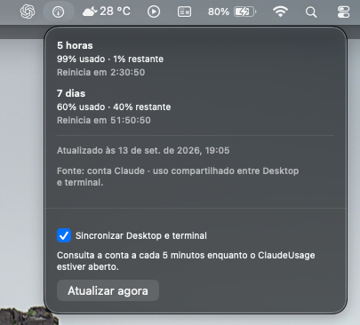
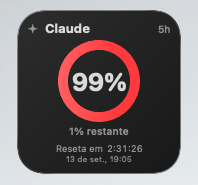
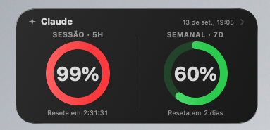
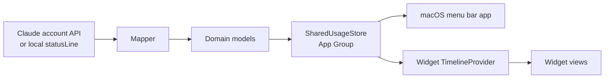

# Claude Usage

A native macOS app that shows your Claude / Claude Code usage in the menu bar and as WidgetKit widgets — 5-hour session limits, 7-day limits, and time until reset, without leaving the desktop.

## Features

- **macOS menu bar app** built with `MenuBarExtra`, showing 5-hour and 7-day usage percentages, remaining percentage, and reset countdown.
- **WidgetKit widgets** in Small and Medium sizes, addable to the desktop or Notification Center.
- **5-hour session usage** and **7-day usage**, each shown independently — a missing window is displayed as "not available," never as 0%.
- **Countdown until reset** for each rate-limit window.
- **Per-model widget configuration** (Automatic / Sonnet / Opus) via a configurable widget (`WidgetSelectionIntent`), when the account reports per-model weekly limits.
- **Context window usage** (input/output tokens, used percentage) shown separately from rate limits, sourced from the local `statusLine` collector.
- **Shared data between the app and the widgets** through an App Group, so widgets render from the last known snapshot without requiring the app to be open.
- **Automatic widget updates**: the app reloads widget timelines (`WidgetCenter.reloadTimelines`) whenever a new usage snapshot is saved.
- Native SwiftUI throughout, no external dependencies.

## Screenshots

| Menu bar | Small widget | Medium widget |
| --- | --- | --- |
|  |  |  |

Current macOS interface in Brazilian Portuguese, showing account usage in the menu bar and both widget sizes.

## Requirements

- macOS 26.5 or later
- Xcode 26.6 or later (ships the Swift 6 toolchain)

`ClaudeUsageCore` declares `swift-tools-version: 6.0`. The `ClaudeUsage` and `ClaudeUsageWidgetExtension` app targets build with `SWIFT_VERSION = 5.0` (Swift 5 language mode) under that same toolchain — the project is not running the whole app in Swift 6 strict-concurrency language mode.

## Installation / Build

1. Clone the repository:
   ```sh
   git clone https://github.com/semellicodes/ClaudeUsage.git
   cd ClaudeUsage
   ```
2. Open `ClaudeUsage.xcodeproj` in Xcode.
3. In **Signing & Capabilities**, select your own Apple Developer Team for both the `ClaudeUsage` and `ClaudeUsageWidgetExtension` targets.
4. Update the **App Group** identifier on both targets (see below) so it is unique to your Team ID, and update the matching identifier in:
   - `App/ClaudeUsageApp.swift`
   - `Widget/UsageTimelineProvider.swift`
5. Build and run the `ClaudeUsage` scheme (`Cmd+R`). The app runs as a menu bar utility (no Dock icon), installed at `~/Applications/ClaudeUsage.app`.
6. Add a widget from the macOS widget gallery, searching for "Claude Usage."

To get usage data flowing:

- **Account sync (recommended):** open the app's menu, enable "Sync Desktop and terminal." This reads the existing Claude Code OAuth login from the Keychain and queries `GET https://api.anthropic.com/api/oauth/usage` only — no API key, no message sending. Requires `claude auth login` to have been run at least once in Claude Code.
- **Local statusLine (optional):** point Claude Code's `statusLine` at `Tools/claude-usage-statusline.sh` (absolute path) to also capture context-window usage from the terminal. See the "Fonte local opcional" section in the code comments and `Tools/diagnose-statusline.sh` for a read-only diagnostic.

Validate a build with:

```sh
swift test --package-path Packages/ClaudeUsageCore
xcodebuild -project ClaudeUsage.xcodeproj -scheme ClaudeUsage -destination 'platform=macOS' build
```

To run the Core tests from Xcode, select the **ClaudeUsage** scheme and press
**Cmd+U**. Its shared `ClaudeUsage.xctestplan` runs the existing
`ClaudeUsageCoreTests` package target and fixtures; no tests are duplicated.
The equivalent command is:

```sh
xcodebuild -project ClaudeUsage.xcodeproj -scheme ClaudeUsage -destination 'platform=macOS' test
```

`swift test --package-path Packages/ClaudeUsageCore` remains available for testing
the package independently.

### One local installation

Debug and Release builds of the app use Xcode's native deployment settings
(`DEPLOYMENT_LOCATION=YES`, `DSTROOT=$(HOME)`, `INSTALL_PATH=/Applications`).
The product is built directly at `~/Applications/ClaudeUsage.app`; changing
DerivedData directories does not create another installed app. The extension
is embedded in that same bundle. Xcode supplies its own staging root for Archive.

The main scheme stops both `ClaudeUsage` and `ClaudeUsageWidgetExtension` before
building. The widget runs in a separate process; stopping only the app can leave
the previous widget code in memory even after its bundle has been updated.
`Cmd+R` builds and launches that same installation; `Cmd+B` and `Cmd+U` leave
the app stopped, so reopen `~/Applications/ClaudeUsage.app` when finished.
Because the installed app is the build product, Xcode Clean can remove it;
building again recreates it. Account data remains in its separate App Group.

For CI or isolated builds, override `DSTROOT` with a temporary directory.
Do not run that temporary app as a second daily installation. This setup does
not remove manually copied apps or prevent explicit build-setting overrides.

To confirm which extension is registered:

```sh
pluginkit -m -A -D -v -i com.paula.ClaudeUsage.ClaudeUsageWidget
```

## App Group

The app and the Widget Extension are separate processes/sandboxes. Sharing a `UsageSnapshot` between them requires an [App Group](https://developer.apple.com/documentation/xcode/configuring-app-groups):

```text
App (menu bar)
  -> writes UsageSnapshot to SharedUsageStore (UserDefaults(suiteName:))
    -> App Group container
      -> Widget Extension reads the same snapshot in its TimelineProvider
```

This repository's App Group identifier is tied to the original developer's Team ID. When building your own copy, use your own identifier, for example:

```text
group.your.bundle.identifier
```

and make sure the entitlements of both targets and the identifier hardcoded in `ClaudeUsageApp.swift` / `UsageTimelineProvider.swift` all match.

## Architecture

The project follows a pragmatic Clean Architecture split, shared between the app and the widget:

- **Domain** (`Packages/ClaudeUsageCore/.../Domain`) — `RateLimit`, `ContextUsage`, `UsageSnapshot`. No SwiftUI, WidgetKit, or I/O knowledge.
- **Data / Mapper** (`.../Data`) — DTOs for the account API and the local `statusLine` JSON, and `ClaudeStatusMapper` / `ClaudeAccountPayload`, the only boundary that turns raw, untrusted JSON into validated Domain models (finite numbers, clamped percentages, no invented data).
- **Persistence** (`.../Persistence`) — `SharedUsageStore` (App Group–backed) and `ClaudeOAuthCredentials` (Keychain read for the existing Claude Code login).
- **App** (`App/`) — `MenuBarExtra` scene, `MenuBarViewModel`, and `StatusFileMonitor` (watches the local status file).
- **Widget Extension** (`Widget/`) — `TimelineProvider`, `WidgetSelectionIntent`, and the SwiftUI views for the Small/Medium widgets.

`ClaudeUsageCore` is the single source of truth for models and validation; both targets depend on it instead of duplicating logic.



## Privacy

No API keys, telemetry, or analytics. The OAuth token is read from the Keychain at request time and never persisted by this app or shared with the widget. Only a sanitized `UsageSnapshot` (percentages, reset dates) crosses the App Group — never raw payload fields like `cwd` or `transcript_path`.

## License

[MIT](LICENSE)
