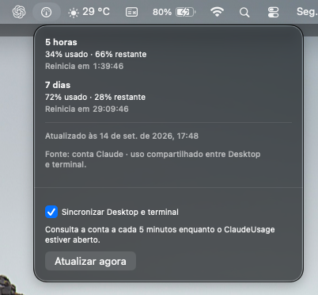
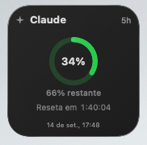
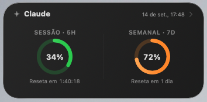
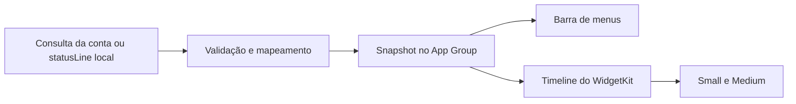

# Claude Usage

Acompanhe os limites da sua conta Claude na barra de menus e em widgets nativos do macOS. Veja quanto já usou, quanto resta e quando as janelas de **5 horas** e **7 dias** reiniciam, sem sair da mesa.

A sincronização consulta os limites da conta usada no Claude Desktop e no Claude Code. Não é necessário manter uma sessão de terminal em execução para atualizar esses limites; o aplicativo ClaudeUsage precisa permanecer aberto para buscar novas leituras.

## Como fica no macOS

Capturas reais da interface em português do Brasil, atualizadas em 14 de setembro de 2026.

### Barra de menus

Uso e saldo das duas janelas, contagem até o reinício, horário da última leitura e controles de sincronização.



### Widgets na mesa

| Small — um limite em destaque | Medium — sessão e semanal lado a lado |
| --- | --- |
|  |  |

Os widgets usam círculos compactos, anéis finos, textos secundários discretos e fundo com material nativo, gradiente e borda suave. O macOS adapta a apresentação ao contexto, inclusive esmaecendo os widgets quando a mesa não está em foco.

## Funcionalidades

- **Limites de 5 horas e 7 dias:** percentual usado e tempo até o reinício de cada janela. A janela de 5 horas não é um limite diário.
- **Saldo restante:** exibido no Small e na barra de menus.
- **Sincronização Desktop e terminal:** consulta automática a cada 5 minutos enquanto o app está aberto, com botão **Atualizar agora**. Em caso de falha ou restrição da API, o intervalo pode aumentar.
- **Widgets Small e Medium:** disponíveis na mesa e na Central de Notificações, com contagens regressivas e horário da última leitura.
- **Seleção de modelo:** Automático, Sonnet ou Opus na opção **Claude Usage · Modelos**. A escolha muda os dados exibidos; não troca o modelo usado no Claude.
- **Escolha da janela no Small:** 5 horas ou 7 dias no widget configurável.
- **Contexto opcional:** barra de uso da janela de contexto no Medium quando há dados do coletor local `statusLine` do Claude Code.
- **Última leitura compartilhada:** os widgets exibem o snapshot salvo pelo app mesmo quando ele está fechado. Novos dados exigem que o app volte a funcionar.
- **Estados explícitos:** dados ausentes ou janelas reiniciadas recebem mensagens próprias, sem inventar consumo de 0%.

### Como interpretar a seleção de modelo

Na sincronização da conta, o limite de **5 horas é compartilhado**. Para o semanal, Sonnet e Opus usam o limite específico do modelo quando a fonte o fornece; caso contrário, usam o limite geral da conta.

O uso da janela de **contexto** é outra medida: descreve o contexto de uma sessão local e não substitui os limites da assinatura. Ele depende do coletor do terminal e não representa automaticamente o contexto do Claude Desktop.

## Primeira utilização

Depois de compilar e abrir o aplicativo:

1. Execute `claude auth login` no Terminal e entre na mesma conta usada no Claude Desktop.
2. Abra o ClaudeUsage pela barra de menus e ative **Sincronizar Desktop e terminal**.
3. Autorize a leitura do login no Chaves, se o macOS solicitar, e clique em **Atualizar agora**.
4. Abra **Editar Widgets…** na mesa e procure **ClaudeUsage**.
5. Adicione **Claude Usage** para a visualização padrão ou **Claude Usage · Modelos** para escolher modelo e janela do Small.

O login do Claude Code fornece a credencial da conta. Depois de autenticar, você pode continuar usando o Claude Desktop normalmente; não precisa gerar mensagens no terminal para alimentar os limites do widget.

Se o login expirar ou perder acesso à consulta de uso, o app informa o problema. Execute novamente `claude auth login` e atualize. Uma chave de API não substitui esse login para consultar os limites da assinatura.

### Contexto do terminal (opcional)

Configure o `statusLine` do Claude Code para executar [Tools/claude-usage-statusline.sh](Tools/claude-usage-statusline.sh), usando o caminho absoluto do script no seu computador. Esse coletor adiciona dados locais de contexto; ele não é necessário para a sincronização dos limites da conta.

[Tools/diagnose-statusline.sh](Tools/diagnose-statusline.sh) ajuda a verificar a configuração local sem modificá-la.

## Compilar e instalar

### Requisitos

- macOS 26.5 ou posterior.
- Xcode 26.6 ou posterior para seguir a configuração de desenvolvimento do projeto.
- Claude Code com login válido para sincronizar os limites da conta.
- Assinatura e App Group configurados para sua equipe no Xcode.

```sh
git clone https://github.com/semellicodes/ClaudeUsage.git
cd ClaudeUsage
open ClaudeUsage.xcodeproj
```

1. Em **Signing & Capabilities**, selecione sua equipe nos targets `ClaudeUsage` e `ClaudeUsageWidgetExtension`.
2. Configure um App Group válido para essa equipe nos dois targets. O identificador do repositório pertence à equipe original; substitua também o valor em `App/ClaudeUsageApp.swift` e `Widget/UsageTimelineProvider.swift` pelo mesmo identificador.
3. Selecione o scheme **ClaudeUsage** e execute **⌘R**.
4. O app será instalado em `~/Applications/ClaudeUsage.app`. Ele funciona na barra de menus, sem ícone no Dock.

O app e a extensão são processos separados. O App Group permite que ambos acessem a mesma leitura salva; identificadores inconsistentes impedem esse compartilhamento.

### Uma única instalação local

As builds Debug e Release usam `DEPLOYMENT_LOCATION=YES`, `DSTROOT=$(HOME)` e `INSTALL_PATH=/Applications`. Assim, builds em diretórios DerivedData diferentes atualizam o mesmo `~/Applications/ClaudeUsage.app`.

O scheme encerra o app e a extensão antes de compilar, evitando que código antigo do widget permaneça em execução. **⌘R** reabre o app; depois de **⌘B** ou **⌘U**, abra-o novamente para retomar a sincronização.

O Clean do Xcode pode remover o app instalado, pois ele é o produto da build. Uma nova build o recria; os dados ficam no App Group separado. Cópias feitas manualmente não são removidas por esse mecanismo.

Para CI ou uma build isolada, sobrescreva `DSTROOT` com um diretório temporário. Não execute esse produto como outra instalação diária. No Archive, o Xcode fornece seu próprio diretório de staging.

## Verificação e diagnóstico

Os testes do pacote Core estão integrados ao scheme **ClaudeUsage** por meio de `ClaudeUsage.xctestplan`. Execute **⌘U** no Xcode ou:

```sh
xcodebuild -project ClaudeUsage.xcodeproj -scheme ClaudeUsage -destination 'platform=macOS' test
```

Também é possível testar o pacote e compilar o app separadamente:

```sh
swift test --package-path Packages/ClaudeUsageCore
xcodebuild -project ClaudeUsage.xcodeproj -scheme ClaudeUsage -destination 'platform=macOS' build
```

Para renderizar cenários locais dos widgets, sem consultar a conta:

```sh
zsh Tools/check-widget-rendering.sh /tmp/claude-usage-preview.png
```

Essa verificação não substitui a inspeção no WidgetKit real. [Tools/check-widget-archives.swift](Tools/check-widget-archives.swift) também verifica dimensões dos arquivos de timeline fornecidos como argumento.

| Sintoma | O que verificar |
| --- | --- |
| Leitura antiga | Confirme que o app está aberto, a sincronização está ativa e não há aviso de erro ou espera para nova tentativa. |
| Login vencido | Execute `claude auth login` com a mesma conta do Desktop e atualize no menu. |
| Limite não informado | A fonte pode não ter enviado essa janela; ausência não significa 0% de uso. |
| Sem barra de contexto | Verifique o coletor `statusLine`; a consulta da conta não fornece o contexto da sessão local. |
| App tem dados, widget não | Confira o App Group nos dois targets e os avisos de sincronização. |
| Aparência esmaecida | O macOS pode apresentar widgets em modo monocromático conforme o foco e as preferências do sistema. |

Para conferir a extensão registrada com o identificador original do projeto:

```sh
pluginkit -m -A -D -v -i com.paula.ClaudeUsage.ClaudeUsageWidget
```

## Organização do projeto

| Diretório | Responsabilidade |
| --- | --- |
| `App/` | App da barra de menus, sincronização e monitoramento do arquivo local. |
| `Widget/` | Configuração dos widgets, timeline e views SwiftUI. |
| `Packages/ClaudeUsageCore/` | Modelos, validação, consulta da conta, persistência e testes compartilhados. |
| `Tools/` | Coletor local e ferramentas de diagnóstico/renderização. |



O pacote Core usa `swift-tools-version: 6.0`. Os targets do app e da extensão usam `SWIFT_VERSION = 5.0` com o toolchain do Xcode. A interface é nativa em SwiftUI, sem bibliotecas externas de UI.

## Privacidade

A sincronização lê o login OAuth existente no Chaves e envia a credencial somente para `https://api.anthropic.com/api/oauth/usage`, para consultar os limites. O app não envia mensagens ao Claude nem exige uma chave de API.

A credencial não é compartilhada com os widgets. O App Group recebe apenas o snapshot tratado para exibição, sem o payload bruto, caminhos de trabalho ou transcrições. O projeto não inclui telemetria ou analytics.

## Padrão de commits

Use o formato `tipo(escopo): descrição concisa`. O tipo é obrigatório; o escopo é opcional.

```text
feat(widget): adiciona seleção de janela no Small
fix(auth): trata login expirado
docs(readme): atualiza funcionalidades e capturas
```

## Licença

[MIT](LICENSE)
